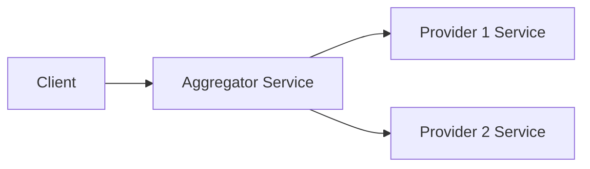
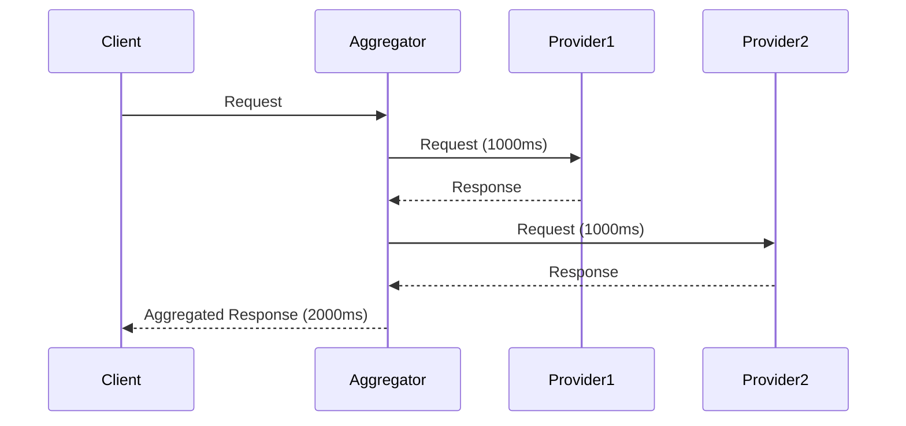
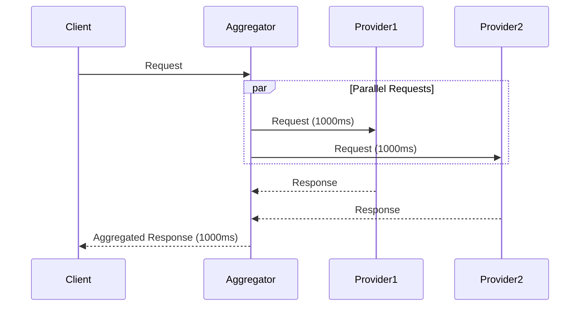

# Scatter-Gather Pattern Example

This project demonstrates the implementation of the scatter-gather pattern using a NestJS aggregator service and two simple Node.js provider services. The aggregator service fetches data from multiple providers concurrently, aggregates the results, and returns them to the client.

## Architecture

The project consists of three main components:

- **Aggregator Service:** A NestJS application that acts as the main entry point for clients. It receives requests, scatters them to the provider services, gathers the responses, and aggregates them into a single response.
- **Provider 1 Service:** A simple Node.js application that simulates a data provider.
- **Provider 2 Service:** Another simple Node.js application that simulates a data provider.

The entire system is orchestrated using Docker Compose, making it easy to run all the services together.

### Illustration



## Getting Started

To run the project, you need to have Docker and Docker Compose installed on your machine.

1.  Clone the repository:

    ```bash
    git clone <repository-url>
    ```

2.  Navigate to the project directory:

    ```bash
    cd scatter-gather
    ```

3.  Run the services using Docker Compose:

    ```bash
    docker-compose up -d
    ```

This will start the aggregator service on port 3000, provider 1 on port 3001, and provider 2 on port 3002.

## API Endpoints

The aggregator service exposes the following endpoints:

- `GET /flights`: Fetches flight data from all providers.
- `GET /hotels`: Fetches hotel data from all providers.

## Performance Comparison

The scatter-gather pattern can significantly improve the response time of the system by fetching data from multiple providers concurrently. The following table shows a comparison of the response times with and without the scatter-gather pattern.

| Approach               | Response Time (ms) |
| ---------------------- | ------------------ |
| Without Scatter-Gather | ~2000ms            |
| With Scatter-Gather    | ~1000ms            |

_Note: The response times are approximate and may vary depending on the network latency and the performance of the provider services._

### Without Scatter-Gather (Sequential)



### With Scatter-Gather (Concurrent)



As you can see from the illustrations and the table, the scatter-gather pattern can reduce the response time by up to 50% in this example.
